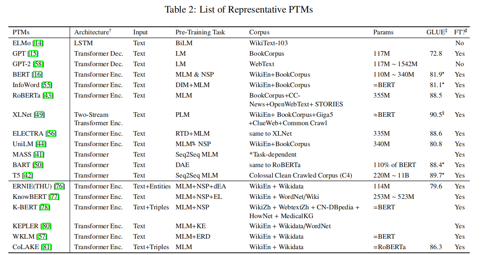

# 一、为何要用知识图谱去增强预训练模型

1. 我们期望，预训练模型能够在需要特定知识或常识的任务中表现得更好，这就需要知道一些先验知识。
2. 为了提高fine-tune后的鲁棒性和可解释性。利用不同的知识来实现具有深刻理解和逻辑推理的预训练模型是不可缺少的。

# 二、常见的问题

1. 结构化信息的非结构化。如何将这样的信息与擅长提取非结构化文本信息的预训练模型结合起来，是开展工作的第一步。
2. 异构特征空间的对齐。由于token部分的特征与知识图谱的embedding是由两种不同的方法得到的，二者所处的特征空间是不完全相同的。
3. 知识噪声。知识图谱信息要与预训练模型良好融合才能提升效果。

# 三、预训练模型的分类

## 3.1 Token-based Pre-trained Models

基于相似上下文的词语可能拥有相同的语义，提出了CBOW和Skip-Gram去捕捉词语的语义相似性。GloVe捕捉词与词之间共现的统计数据，FastText用文本分类数据训练模型。这些模型简单而有效，但不能捕获多义词，只能获得固定的表示，被称为静态预训练模型。

---

## 3.2 Context-based Pre-trained Models

为了解决一词多义的问题，预训练模型需要去识别单词的语义并且在不同的上下文时动态生成单词的embedding。
[ELMO](./pretrain%20model/classical%20paper/ELMO.pdf)作为神经网络编码器，用双向语言模型，捕捉依赖于上下文的表示。但ELMO经常用于特征提取器去产生用于下游任务的模型的初始embedding，但模型剩下的参数不得不从头开始训练。

与此同时，[ULMFiT](./pretrain%20model/classical%20paper/ULMFiT.pdf)提出了通用语言模型微调，为模型提供了有价值的多阶段转移和微调技能。此外，transformer在机器翻译上，尤其是长文本依赖上展现了比LSTM好的性能。在这个背景下，OpenAI提出了[GPT](./pretrain%20model/classical%20paper/GPT.pdf), [GPT-2](./pretrain%20model/classical%20paper/GPT-2.pdf), [GPT-3](./pretrain%20model/classical%20paper/GPT-3.pdf)，使用了修改后的transformer的解码器作为语言模型学习通用表示。但受单向编码器的限制，GPT系列只能学习左边上下文，在生成任务上表现较好，但导致学习句子级别的语义没有达到最优。

为了克服单向的缺点，[BERT](./pretrain%20model/classical%20paper/BERT.pdf)采取了masked language modelling(MLM)，随机遮盖掉一部分单词，去根据上下文预测这单词本身，以及通过next sentence prediction(NSP)任务学习句子之间的语义表示。基于BERT，[RoBERTa](./pretrain%20model/classical%20paper/RoBERTa.pdf)设计了一些改进方案，包括更大批次、更长时间、动态遮盖等。[XLNet](./pretrain%20model/classical%20paper/XLNet.pdf)提出了一种基于排列语言建模的自回归方法（Permutation Language Model），随机选取一句话的一种排列，然后将末尾一定量的词给遮掩掉，通过自回归按这个排列依次预测被遮掩掉的词，通过单向方式来学习双向信息。

[T5](./pretrain%20model/classical%20paper/T5.pdf)不同于上面任意一种，而是采用了编码器-解码器（encoder-decoder）架构，无论是翻译，问答，还是分类等下游任务，都通过把数据转换为text-text格式来统一理解与生成两大任务。

[BART](./pretrain%20model/classical%20paper/BART.pdf)采用标准transformer-based架构，可以看作是BERT和GPT等很多最近的pretrain model的泛化。BART使用在Seq2Seq模块上额外加入了噪声函数，学习一个模型去重建原始的文本。最好的效果是使用sentence shuffling和text infilling。

邱锡鹏论文中对预训练模型和知识增强的预训练模型的总结

---

# 四、知识增强的预训练模型

## 4.1 知识表示

### 4.1.1 基于距离度量的传统模型

知识表示学习用深度学习的方式学习实体和关系在知识图（knowledge graph）中的表示，有效地测量了实体和关系之间的语义相关性，并缓解了稀疏性问题。传统的知识表示模型，例如[TransE](./knowledge%20injection/classical%20paper/NIPS-2013-translating-embeddings-for-modeling-multi-relational-data-Paper.pdf)，基于距离度量的方法，实体h和实体t被转换向量r关联起来:
$h+r≈t$，从而可以用$(h,r,t)$三元组来表达知识。但TransE对于复杂关系建模效果差，以及没有充分利用知识库中的额外信息。

### 4.1.2 语义匹配模型

语义匹配模型将实体的潜在语义和关系与基于相似性的评分函数来进行匹配。这类模型将每个实体与向量关联，将关系与矩阵关联，一个三元组$(h,r,t)$的分数通过双线性函数或者神经网络等来评估。

### 4.1.3 图神经网络模型

上面的模型都基于三元组来编码实体和关系，图神经网络基于整个图结构来做。图卷积神经网络（[GCN](./knowledge%20injection/classical%20paper/Spectral%20Networks%20and%20Deep%20Locally%20Connected%20Networks%20on%20Graphs.pdf)）聚合了每个节点的邻居信息，有效地表示了节点。[R-GCN](./knowledge%20injection/classical%20paper/R-GCN%20Modeling%20Relational%20Data%20with%20Graph%20Convolutional%20Networks.pdf)针对link prediction和entity classification两个任务，用图卷积神经网络建模关系型数据，解决了知识库中高维关系型数据的特征表示。[SACN](./knowledge%20injection/classical%20paper/End-to-end%20Structure-Aware%20Convolutional%20Networks%20for%20Knowledge%20Base%20Completion.pdf)
用了端到端的学习框架，编码器利用了图节点结构和属性，解码器简化了[ConvE](./knowledge%20injection/classical%20paper/Convolutional%202D%20Knowledge%20Graph%20Embeddings.pdf)并保持了TransE的平移不变性。[Learning Attention-based Embeddings for Relation Prediction in Knowledge Graphs](./knowledge%20injection/classical%20paper/Learning%20Attention-based%20Embeddings%20for%20Relation%20Prediction%20in%20Knowledge%20Graphs.pdf)基于[GAT](./knowledge%20injection/classical%20paper/GAT%20GRAPH%20ATTENTION%20NETWORKS.pdf)的框架，提出了一种基于注意力的特征嵌入，该嵌入可以捕获编码器中的实体和关系特征，根据邻居节点的重要度来分配不同权重。[CompGCN](./knowledge%20injection/classical%20paper/CompGCN%20COMPOSITION-BASED%20MULTI-RELATIONAL%20Graph%20Convolutional%20Networks.pdf)认为在消息传递过程中，应该整体考虑节点和关系，利用知识图嵌入技术中各种关系的组合操作，并根据关系的数量来共同嵌入节点和关系。

## 4.2 知识增强的预训练模型

这一类模型可以提升对于语义的深度理解和逻辑归因，从而提升预训练模型在下游任务的表现。我们可以把它分类为：实体增强(entity enhanced)、三元组增强(triplet enhanced)和其他知识(other knowledge enhanced)增强的预训练模型。
还有一个标准是couple-based和decouple-based（retrieval-based）。entity enhanced均属于couple-based。

entity enhanced: 注重实体知识，通过注入实体信息和语言表示来注入知识。一种是把实体特征和单词嵌入通过文本编码器注入，另一种是发挥编码器的力量在知识图的监督下去捕捉隐含的文本知识。

triplet enhanced: 注重triplet层面的知识，使用了实体的特征和三元组的结构信息，通过注入或者检索triplet来注入知识。但coupled-based无法保证符号性知识的可解释性，因为这一类模型用了同一组参数存储知识和语言信息。decoupled-based模型使得知识利用可检测可解释。

other knowledge enhanced: 通过联合训练知识和序列或从所提供的语料库中检索相关信息来实现性能的提高。

### 4.2.1 entity enhanced pre-trained models

---

#### 4.2.1.1 Entity Feature Fused KEPTMs

---

**[SenseBERT](./knowledge%20injection/classical%20paper/SenseBERT%20Driving%20Some%20Sense%20into%20BERT.pdf):** 在词义层面应用自监督，显著提升词义消歧能力，在复杂的 Word in Context (WiC) 语言任务中取得了当前最优结果。

Method: 添加一个掩蔽词义预测任务作为辅助任务，添加了一个专家构建的外部知识库WordNet，训练模型除了预测mask的单词本身以外，还要预测单词的语义，这是一个分类任务。WordNet把词语分成了45个超类，并且把类别映射到和word embedding同样的空间。

评价：起到了一定的消除歧义作用，但把词语的SuperSense分为45类，这样的知识库形式过于简单，如果复杂知识嵌入可能难以参考借鉴。并且，S直接映射到和word同样的空间，把S和W值相加，会不会降低了可解释性。

---

**[SemtiLARE](./knowledge%20injection/classical%20paper/SentiLARE%20Sentiment-Aware%20Language%20Representation%20Learning%20with%20Linguistic%20Knowledge.pdf):** 解决细粒度的情感分类，引入单词级别的语言学外部知识，通过标签感知的MLM任务为BERT注入情绪极性及其词性。

Method: 和上面那个研究很像，只不过这次加入的是单词级别的情感编码。通过一个词在这个句子中的词性和上下文，可以得到一个对这个词在此处情感的打分，最终标记为positive/negative/neutral，也就是极性。然后把词性的编码和极性的编码都加入到embedding中，预测的时候也是预测单词、词性、极性三样，loss相加。

评价：本质上是利用了一个外部的[SentiWordNet](https://github.com/aesuli/SentiWordNet)检索词性和极性，然后再把检索出来的结果融入embedding中。把情感的强弱忽略，只有三个标签：正、负、中性，词性的编码也只有5种，问题和上面的一样，可能过于简单，并且只适用于非常简单的外部知识形式。但对于有一个SentiWordNet网络作为外部知识的情况，会不会不转变成单个的标签，而是直接使用网络输出的编码会好一点？

---

#### 4.2.1.2 Knowledge Graph Supervised Pre-trained Models

---

**[WKLM](./knowledge%20injection/classical%20paper/WKLM%20Pretrained%20Encyclopedia%20Weakly%20Supervised%20Knowledge-Pretrained%20Language%20Model.pdf):** 为了直接从非结构文本中提取真实世界的知识，WKLM设计了基于实体替换检测的弱监督学习模型，迫使模型合并真实世界实体的知识。

Method: 对于输入的文本，首先识别实体并且把他们链接到维基百科的实体上，这个可以看作正例。然后随机把实体替换成同样类型的其他实体。这种思路类似于三元组中的负采样技术，不过这里知识来源于非结构化的文本，预测任务是判断这个实体是否被替换过。

评价：这里被综述的作者归类于Knowledge Graph Supervised Pre-trained Models，是因为这里不是以实体为核心直接从知识库中抽取特征，而是把知识库作为采样的来源做监督学习，间接地融入知识。文章的出发点应该是提高entity的预测难度，想给entity融入更多的上下文信息。

但是我猜测可能有三个不足，一是同名的实体会不会有多种含义，比如人名，二是会不会有虚假的相关性，比如奥巴马是美国总统，随机替换为特朗普，语义上依旧正确，但根据负采样结果为False。三是貌似没有利用Wikipedia的link之间组成的网络关系。

---

**[LIBERT](./knowledge%20injection/classical%20paper/LIBERT%20Specializing%20unsupervised%20pretraining%20models%20for%20word-level%20semantic%20similarity.pdf):** 和WKLM思路相似，都是把外部知识库当做监督学习的数据来源，而非直接embedding。和WKLM不同的是，LIBERT使用的不是单个实体，而是预测一对实体的语义是否相似。

Method: 除了MLM和NSP两个任务，增加了一个LRC任务（语义关系分类）。使用WordPiece分割每个词，然后每个片段分别做segment embedding和position embedding，通过一个简单线性层+softmax分类，判别是否是同义词或者上下位词。

评价：只与based bert进行了对比，说明增加的预训练任务是有效的，缺乏与其他预训练的比较，不知道实际效果如何。感觉本质上其实和WKLM差不多，甚至可能不如WKLM，因为这里只是作为额外输入单纯地加了一个判断两词关系，反而失去了句子中上下文的信息。

但这个工作给我们一点启示是，只要更新的embedding可以对齐，我们的预训练任务、甚至输入的数据，都可以是完全独立的。以及这里面也用到了wordpiece，大胆猜想中文上是否有类似的工作，考虑偏旁和部首去预测语义。

---

**[GLM](./knowledge%20injection/classical%20paper/GLM%20Exploiting%20structured%20knowledge%20in%20text%20via%20graph-guided%20representation%20learning.pdf):** 这篇工作摆脱了提取实体语义相似性的思路，而是转而在知识图的指导下，捕捉文本中实体的隐含关系，比直接从连接的图三元组中学习的方法更有效地进行泛化。

Method: 提出一种新的采样技术和一个的预训练任务DSR(DISTRACTOR-SUPPRESSED RANKING TASK)。从KG中根据隐含的关系信息进行采样和mask，排除随机采样出现的无意义词汇（比如what do）和在图中难以到达的词汇，这样负采样出来的词更加接近原词，但具体语境中含义不同，可以学到更加微妙的表达和知识。采样的概率和这个实体在文档中出现的次数以及在KG中与这个实体的距离有关。除了MLM之外，DSR任务还要预测正实体和负实体与原句表示的相似性。

$H$是一堆词$w$经过TransformerEncoder之后的表示，则
MLM的损失是：

$$
\mathcal{L}_{M}=-\frac{1}{|\mathcal{M}|}\sum_{i \in \mathcal{M}}logP(w_i|H_{:,i})
$$

$v_j$是出现实体$e_j$的句子的表示的平均值，$u_j$是positive entity前面加[CLS]后面加[ENT]的嵌入，$u^{'}_j$是negative entity前面加[CLS]后面加[ENT]的嵌入。然后用单层网络映射来比较$v$和两个$u$的相似性，分别记为$s_j$和$s_j^{'}$,下面是损失函数。

$$
\mathcal{L}_R=\frac{1}{m}\sum_{j=1}^{m}\max(\lambda-s_j+s_j^{'},0)
$$

总的损失函数：

$$
\mathcal{L}=\mathcal{L_M}+\gamma\mathcal{L_R}
$$

评价：仅靠不随机选取negative entity而是根据KG随机选取，一定程度上是可以采到语义更相似的词汇，但为什么不通过其他模型embedding好的空间相似性去采样，而要通过KG呢？这样是否有效利用了link的关系呢？

---

### 4.2.2 Triplet Enhanced Pre-trained Models

---

#### 4.2.2.1 Coupled-based KEPTMs

---

**[ERNIE](./knowledge%20injection/classical%20paper/Ernie%20Enhanced%20language%20representation%20with%20informative%20entities.pdf):** 这个模型充分利用词汇、句法和知识信息，将预先训练好的实体嵌入与文中的实体集成在一起，在实体类型和关系预测上达到了最优。

Method: 首先要提取知识。KG是类似于TransE等知识嵌入算法编码的，而不是直接的图结构。在文本中识别出KG中包含的实体并且与KG中的实体对齐融合，作为ERNIE的输入，所以KG中的实体表示就集成到语义模块中了。

接下来增加一个预训练任务denoising entity auto-encoder (DEA)：随机mask一些命名实体，要求模型聚合上下文和KG的信息，去预测token和entity，从而获得知识增强的语言表示模型。

评价：优点是通过K-Encoder巧妙地融合了entity和token。不过不懂的是，作为一个整体的实体为何不学习其整体表示，而要分成多个token呢。

---

**[KnowBERT](./knowledge%20injection/classical%20paper/KnowBERT%20Knowledge%20enhanced%20contextual%20Word%20Representations.pdf):** 和一个实体链接模型端到端地联合学习实体的表示，从而把事实融入到实体中。

**[BERT-MK](./knowledge%20injection/classical%20paper/BERT-MK%20Integrating%20graph%20contextualized%20knowledge%20into%20pretrained%20language%20models.pdf):** 