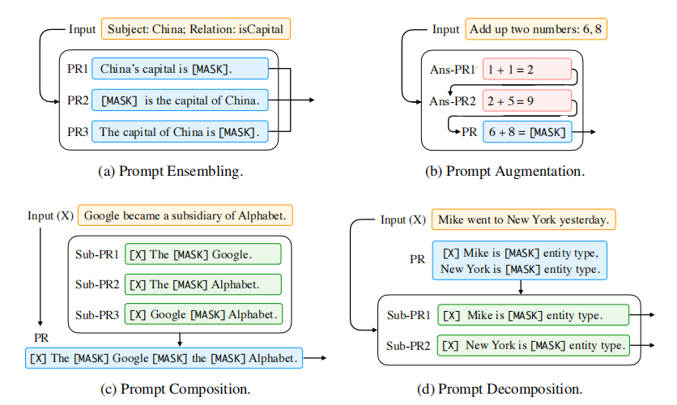

# Propmt Tuning Introduction

Unlike traditional supervised learning, which model input $x$and predict an output $y$ as $P(y|x)$, **prompt-based** learning is based on language models that model the probability of text directly. So the input $x$ is modified using a template into a textual string prompt $x^{'}$ that has some unfilled slots, and then the language model fill the information to obtain a final string $\hat{x}$.

**Why it is powerful?** It allows the language model to be pre-trained on massive amount of raw text, and by defining a new prompting function the model is able to perform *few-shot* or even *zero-shot* learning, adapting to new scenarios with few or no labled data.

Prompting predicts the highest-scoring $\hat{y}$ in 3 steps.

1. prompt addition
   a function $f_{prompt}(·)$ modify the input text $x$ into a prompt $x^{'}$, containing [z] slot and [x] slot. [x] slot is input text (question) and [z] slot is answer.
2. answer search
   search highest-scoring text $\hat{z}$ that maximaizes the score of the LM$P(x;\theta)$.
3. answer mapping
   go from highest-scoring answer $\hat{z}$ to the highest-scoring output $\hat{y}$.

# Design Consideration for Prompting

1. Pre-trained Model Choice: calculate $P(x;\theta)$.
2. Prompt Engineering: choose which prompt we should use as $f_{prompt}(x)$.

   1. Prompt Shape: for tasks regarding generation, or tasks using a standard auto-regressive LM, prefix prompts tend to be more conducive. For the tasks using masked LMs, cloze prompt are a good fit.
   2. Manual Template Engineering
   3. Automated Template Learning: automate the template design process, including *discrete prompts*(prompt is a text string) and *continuous prompts*(prompt is described directly in the embedding space of the underlying LM).
3. Answer Engineering: design $ \mathcal{Z}$ differently(the set of answer), possibly along with the mapping function.

   1. Answer Shape: tokens, span, sentence
   2. Answer Space Design Methods: manual design, discrete answer search, continuous answer search
4. Expanding the Paradigm: above is the simplest of the various underlying frameworks, there are ways to expand this underlying paradigm.

   - *Prompt Ensembling* use multiple unanswered prompts for an input at inference time to make predictions.
   - *Prompt Augmentation* provides a few additional answered prompts used to demonstrate how the LM should provide the answer
   - *Prompt Compostion* use multiple sub-prompts, each for one subtask.
   - *Prompt Decomposition* break down the holistic prompt into different sub-prompts, and answer each sub-prompt separately.

   
5. Prompt-based Training Strategies: train parameters either of the prompt, the LM, or both.

   In many cases, prompting methods can be used without any explicit training of the LM for the down-stream task, this is called *zero-shot* setting.

   However, there are methods that use training data to train the model with prompting methods: full-data learning and few-shot learning.

   Parameter Update Methods: update the parameters of LM or prompts based on (i) whether the parameters of the underlying LM are tuned, (ii) whether there are additional prompt-related parameters, (iii) if there are additional prompt-related parameters, whether those parameters are tuned.

   - Promptless Fine-tuning
   - Tuning-free Prompting
   - Fixed-LM Prompt Tuning
   - Fixed-prompt LM Tuning
   - Prompt+LM Tuning

# Applications

1. knowledge Probing
2. Classification-based Tasks
3. Information Extraction
4. Reasoning in NLP
5. Question Answering
6. Text Generation
7. Automatic Evaluation of Text Generation
8. Multi-modal Learning
9. Meta-Applications

# Prompt-relevant Topics

1. Ensemble Learning
2. Few-shot Learning
3. Larger-context Learning
4. Query Reformulation
5. QA-based Task Formulation
6. Controlled Generation
7. Supervised Attetion
8. Data Augmentation

# Challenges

1. Prompt Design:
   1. use prompt for information extraction and text analysis tasks
   2. express structure information in prompt is a major challenge
   3. how to simultaneously search or learn for the best combination of template and answer
2. Answer Engineering
   1. Many-class and Long-answer Classification Tasks
   2. Multiple Answer for Generation Tasks
3. Selection of Tuning Strategy
4. Multiple Prompt Learning
   1. Prompt Ensembling
   2. Prompt Composition and Decomposition
   3. Prompt Augmentation
   4. Prompt Sharing
5. Selection of Pre-trained Models
6. Theoretical and Empirical Analysis of Prompting
7. Transferability of Prompts
8. Combination of Different Paradigms
9. Calibration of Prompting Methods
